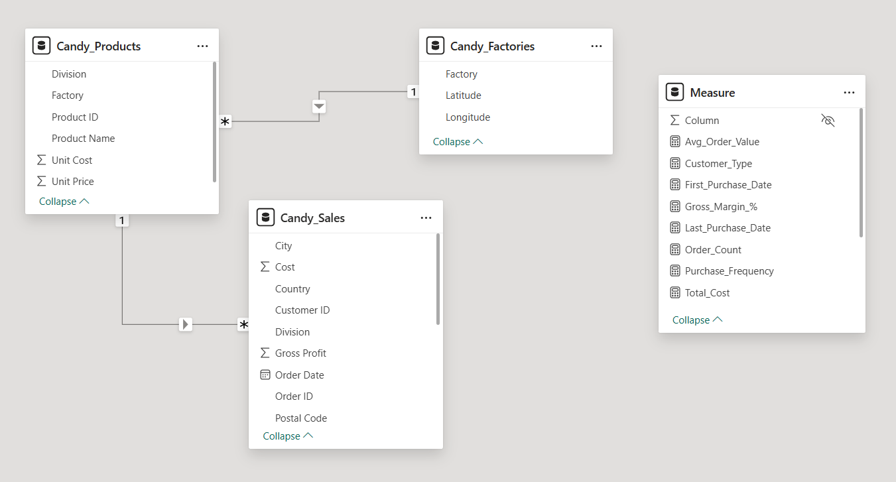
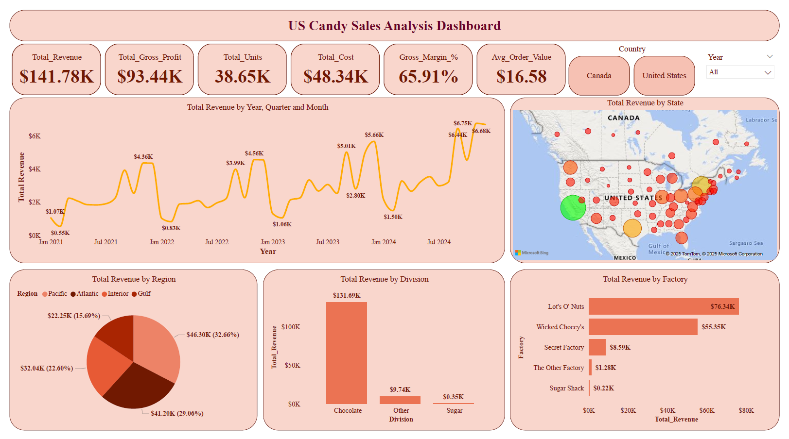
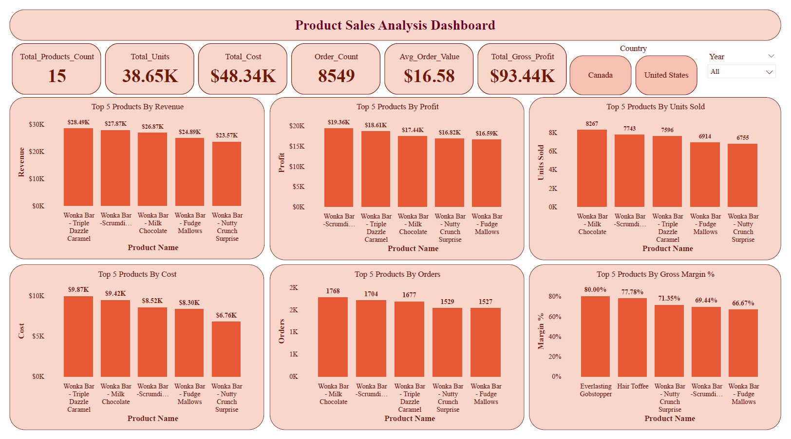
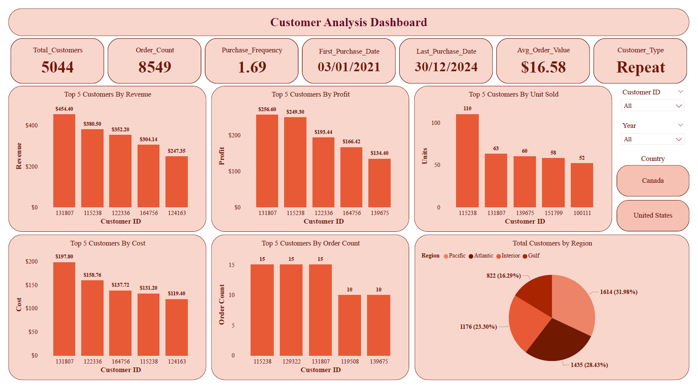
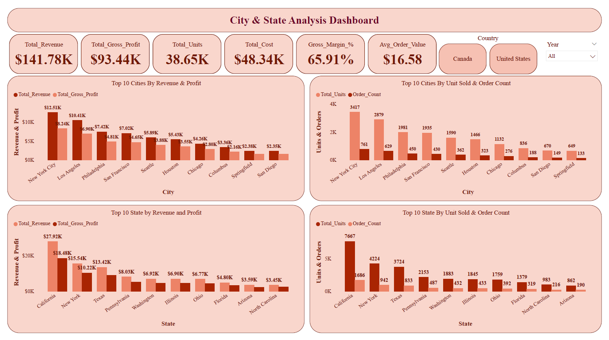

# 💡 Power Bi Project by Yash Yennewar

# 🍬 US Candy Distributor Sales Analysis Dashboard
An interactive Power BI project analyzing US Candy Distributor sales to uncover insights on revenue, customers, products, and regional performance.

## 🔗 Project Link :

[US_Candy_Distributor_Analysis](US_Candy_Distributor_Analysis_1.pbix)

---

## 📌 Project Overview :
This Power BI project analyzes the sales performance of a **US Candy Distributor**, uncovering insights about revenue, customers, products,and regional trends across the United States and Canada.
The goal of this project is to help the distributor **optimize sales strategies, identify profitable products and regions, and improve customer retention**.

---

## 🧩 Dataset Information :

- **Source:** [Maven Analytics -- US Candy Distributor Dataset](https://mavenanalytics.io/data-playground/us-candy-distributor)
- **Data Structure:** Multiple tables (Fact & Dimension Model)
- **Fact Table:** `sales_transactions`
- **Dimension Tables:** `customer_dim`, `product_dim`, `factory_dim`, `city_dim`, `state_dim`, `region_dim`, `date_dim`
- **Time Period:** 2021 -- 2024
- **Country Coverage:** United States & Canada

---

## 📸 Data Model Screenshot : 


---

## 📈 Key Performance Indicators (KPIs)

- 💰 **Total Revenue** - Overall sales revenue generated.
- 🧾 **Total Units Sold** - Number of candy units sold.
- 📦 **Total Orders** - Number of distinct orders placed.
- 🏭 **Total Cost** - Total cost incurred for all products.
- 📊 **Gross Profit** - (Total Revenue - Total Cost).
- 💹 **Gross Margin %** - Profitability percentage.
- 💵 **Average Order Value (AOV)** - Average revenue per order.
- 👥 **Total Customers** - Total unique customers.
- 🔁 **Purchase Frequency** - Avg. number of orders per customer.

---

### 📐 DAX (Data Analysis Expressions)  
Some important DAX measures created for the analysis :
```
DAX
Total_Revenue = SUM(Candy_Sales[Sales])
Total_Gross_Profit = SUM(Candy_Sales[Gross Profit])
Gross_Margin_% = DIVIDE(([Total_Revenue]-[Total_Cost]),[Total_Revenue],0)
Avg_Order_Value = DIVIDE([Total_Revenue],[Order_Count],0)
Purchase_Frequency = DIVIDE([Order_Count],[Total_Customers],0)
Customer_Type = IF([First_Purchase_Date] = MAX(Candy_Sales[Order Date]), "New", "Repeat")
```

---

## 📊 Dashboards & Insights
### 🧁 1. US Candy Sales Analysis Dashboard

**KPIs Included:** Revenue, Profit, Units, Cost, Margin%, AOV
**Visuals:**
- Revenue Trend by Year, Quarter, Month
- Revenue by State (Map Visualization)
- Revenue by Region, Division & Factory

**Insights:**
- Total revenue: **\$141.78K**, Profit margin: **65.91%**
- **Chocolate Division** dominates with 93% of total revenue.
- **Lot's O' Nuts** and **Wicked Choccy's** are top-performing factories.
- The **Atlantic region** drives the highest share of total sales.



---

### 🍫 2. Product Sales Analysis Dashboard

**KPIs Included:** Total Products, Total Units, Total Cost, AOV, Gross Profit
**Visuals:**
- Top 5 Products by Revenue, Profit, Cost, Orders & Units Sold
- Top 5 Products by Gross Margin %

**Insights:**
- **Wonka Bar -- Triple Dazzle Caramel** leads with **\$28.49K revenue**.
- **Everlasting Gobstopper** shows the **highest gross margin (80%)**.
- Profit and revenue are concentrated among 5 key product lines.



---

### 👥 3. Customer Analysis Dashboard

**KPIs Included:** Total Customers, Order Count, Purchase Frequency, AOV
**Visuals:**
- Top 5 Customers by Revenue, Profit, Cost, Units Sold & Orders
- Customer Segmentation by Region

**Insights:**
- Total Customers: **5,044**, Average Order Value: **\$16.58** 
- **Repeat Customers** generate majority of revenue.
- Top customer (ID 131807) contributes **\$454.40 in revenue**.
- Highest customer concentration in the **Pacific Region (32%)**.



---

### 🏙️ 4. City & State Analysis Dashboard

**KPIs Included:** Total Revenue, Profit, Units, Cost, Margin %
**Visuals:**
- Top 10 Cities & States by Revenue and Profit
- Top 10 Cities & States by Units Sold & Order Count

**Insights:**
- **New York City** leads with **\$12.5K revenue**, followed by **Los Angeles**.
- **California** is the top-performing state with **\$27.9K revenue**.
- High sales density in coastal and metropolitan areas.



---

## 📉 Key Insights Summary

- The company maintains a **healthy profit margin (\~66%)**.
- **Chocolate-based products** dominate both revenue and sales.
- **Repeat customers** are the main source of revenue, highlighting Strong brand loyalty. Sales trend shows consistent **growth from 2023 to 2024**.
- **California, New York, and Texas** are the top-performing states. Opportunities exist in low-performing regions like **Gulf & Interior** for targeted promotions.

---

## 🧾 How to Use

1.  Download the `.pbix` file: **US_Candy_Distributor_Analysis_1.pbix**
2.  Open with **Power BI Desktop**
3.  Explore dashboard pages using filters for:
    -   Year
    -   Country (United States / Canada)
    -   Customer / Product filters

---

## 🏁 Conclusion
This Power BI project delivers a **comprehensive end-to-end sales analysis**, enabling actionable insights into **revenue growth, customer behavior, and regional performance**.
It demonstrates key **data analytics and visualization skills** suitable for Data Analyst and Business Intelligence roles.
